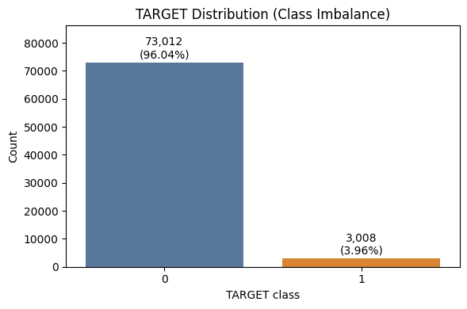
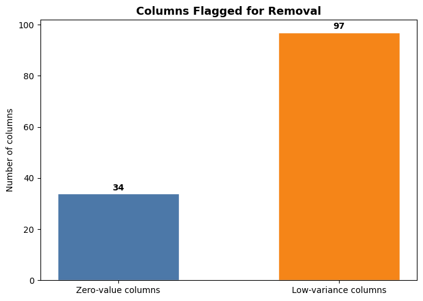
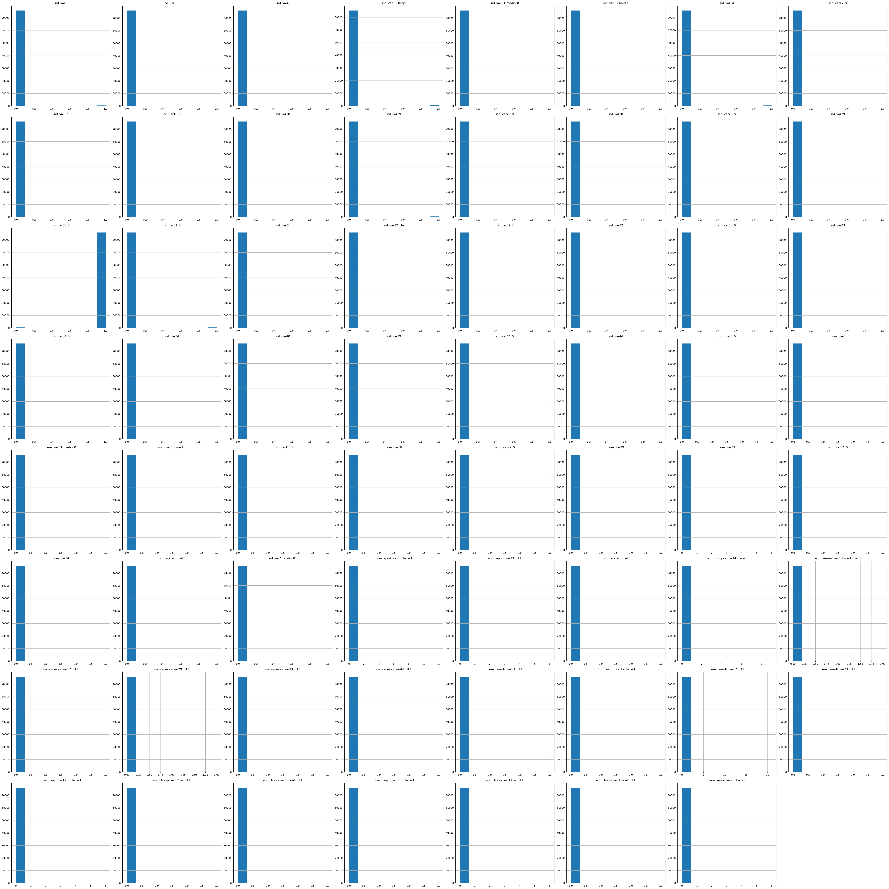
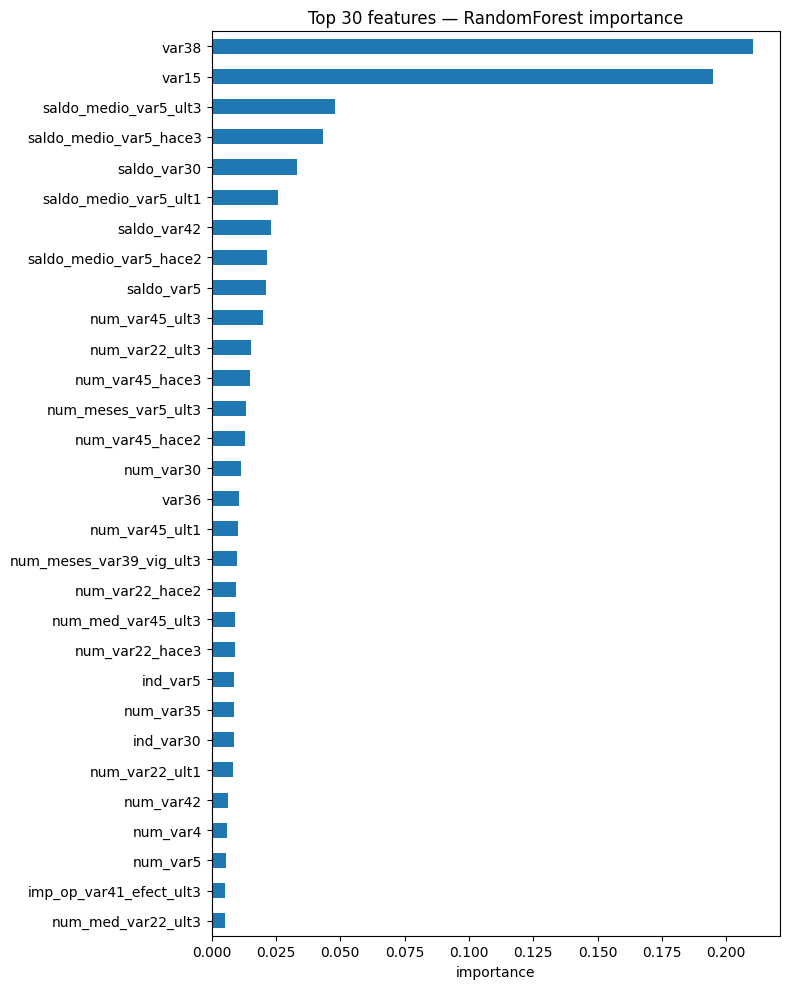
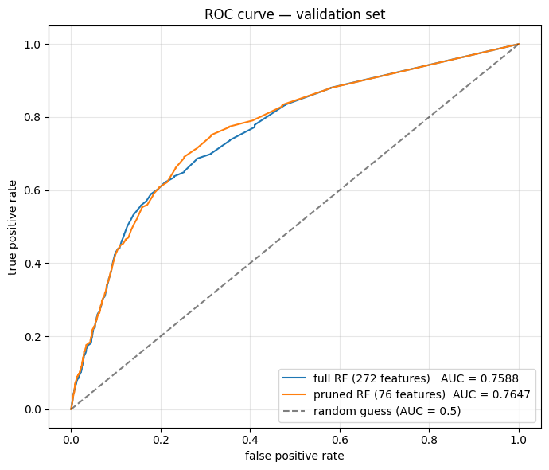
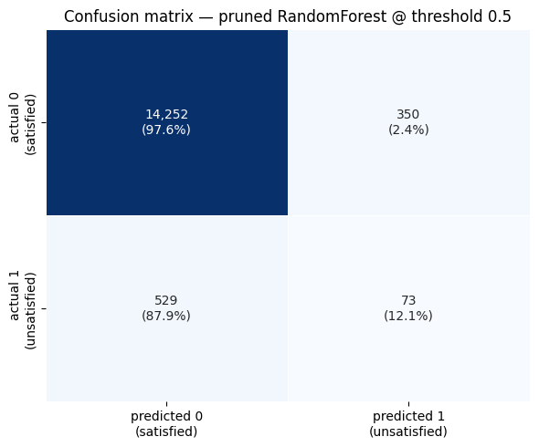

# Santander Customer Satisfaction — Tabular Kaggle Classification Project

**Course:** DATA 3402 | University of Texas at Arlington
**Instructor:** Dr. Farbin
**Kaggle Competition:** [Santander Customer Satisfaction](https://www.kaggle.com/competitions/santander-customer-satisfaction)

---

## Project Overview

This project tackles the Santander Customer Satisfaction Kaggle competition: a binary classification problem where the goal is to predict whether a bank customer is unsatisfied (`TARGET = 1`) or satisfied (`TARGET = 0`) using anonymized transactional and account data. The competition is scored on **ROC-AUC**, which is the appropriate metric here given the heavy class imbalance.

The dataset is challenging because:
- All 370 features are anonymized (e.g. `var15`, `saldo_var13`, `imp_op_var40_ult1`) — there is no public documentation explaining what they represent.
- The classes are extremely imbalanced (~96% satisfied / ~4% unsatisfied).
- Many columns are sparse or near-constant, requiring careful filtering before modeling.

---

## Dataset Summary

| Property | Value |
|---|---|
| Rows | 76,020 |
| Raw features | 370 |
| Target | Binary (0 = satisfied, 1 = unsatisfied) |
| Missing values | None |
| Class balance | 96.04% / 3.96% (severe imbalance) |
| Feature types | All numeric (anonymized) |

Feature naming convention (Spanish-origin prefixes):
- `ind_` — binary indicator flags
- `num_` — counts
- `saldo_` — account balances
- `imp_` — monetary amounts
- `delta_` — change between time periods
- `_ult1`, `_ult3` — last 1 / last 3 months
- `_hace2`, `_hace3` — 2 / 3 months ago

### Class Imbalance

The `TARGET` distribution is heavily skewed: 73,012 satisfied customers (96.04%) vs. 3,008 unsatisfied (3.96%). This drove two important modeling decisions later — using ROC-AUC instead of accuracy, and using `class_weight='balanced'` in the classifier.

---

## Approach

### 1. Data Loading & Initial Inspection
- Loaded `train.csv` and dropped the `ID` column (non-predictive).
- Verified no missing values across all 370 features.
- Confirmed all features are numeric.
- Visualized the `TARGET` distribution and confirmed the severe class imbalance shown above.

### 2. Exploratory Data Analysis

Computed per-feature correlation with `TARGET` to see which variables had any obvious linear relationship:

The strongest correlations were only ~0.10 (`var36`, `var15`), suggesting linear models alone would not perform well and that a non-linear model (e.g. tree ensemble) was the better choice.

### 3. Data Cleaning

Two filtering steps were applied to remove uninformative columns:

**Step A — Drop fully-zero columns:** Identified and removed 34 columns where every single value was 0. This reduced the column count from 370 → 336.

**Step B — Variance Threshold filtering:** Used `sklearn.feature_selection.VarianceThreshold` with a threshold of 0.1 to remove an additional 97 near-zero variance features. The histograms below show a representative sample of the columns that were dropped — they are essentially constant at zero with only a handful of nonzero values, confirming they would not contribute useful signal:

After both cleaning steps, **272 features remained** for modeling.

The motivation: with anonymized data, manual feature inspection is not feasible. A variance-based filter is the principled way to remove sparse columns automatically without losing meaningful signal.

### 4. Modeling

**Train/Validation Split:** Stratified 80/20 split using `train_test_split(stratify=y)` to preserve the rare positive class proportion in both sets.

**Baseline Model:** `RandomForestClassifier` was chosen because:
- It handles high-dimensional data without requiring feature scaling.
- It is robust to anonymized features and non-linear relationships.
- It produces feature importances directly, enabling further pruning.

Key hyperparameters:
- `class_weight='balanced'` to compensate for the ~96/4 class imbalance.
- `n_estimators=200` for stable importance estimates.
- `n_jobs=-1` for parallel training.

**Feature Importance:** After training the baseline, extracted `feature_importances_` to see which features the model actually relied on. The top features were dominated by `var38`, `var15`, and several `saldo_medio_var5_*` columns:

**Feature Pruning:** Used cumulative importance to select the smallest set of features that account for 95% of total importance. This is a more principled cutoff than picking an arbitrary "top N." This reduced the feature set from 272 → 76.

**Pruned Model:** Retrained `RandomForestClassifier` with the same hyperparameters on only the pruned feature set, allowing an apples-to-apples comparison against the full-feature baseline.

### 5. Evaluation

Compared full-feature vs. pruned models on the validation set using ROC-AUC (the official Kaggle metric), confusion matrix, and classification report.

---

## Results

### ROC Curve Comparison

| Model | Features | Validation ROC-AUC |
|---|---|---|
| Random Forest (full) | 272 | **0.7588** |
| Random Forest (pruned) | 76 | **0.7647** |

**Key finding:** The pruned model achieves slightly higher ROC-AUC than the full-feature model while using only 28% of the features (76 vs 272). This confirms that most of the signal is concentrated in a small subset of the original 370 features, and that the variance filtering + importance pruning pipeline successfully isolated the predictive ones.

### Confusion Matrix (Pruned Model, threshold = 0.5)

The confusion matrix highlights a known limitation: at the default 0.5 probability threshold, the model correctly identifies 97.6% of satisfied customers but only 12.1% of unsatisfied customers. This is expected given the 96/4 class imbalance — the model ranks the rare class reasonably well (as the AUC of 0.76 shows), but the default threshold is not tuned for recall on the minority class. In a production setting, the decision threshold would be tuned to the business cost of false negatives vs. false positives. Since the Kaggle competition is scored on AUC (which is threshold-independent), threshold tuning was not required for this project.

---

---

## Summary of Pipeline

| Step | Action | Columns Remaining |
|---|---|---|
| 0 | Load raw `train.csv` | 371 |
| 1 | Drop `ID` and `TARGET` from feature set | 370 |
| 2 | Drop 34 fully-zero columns | 336 |
| 3 | Apply `VarianceThreshold(0.1)` — drop 97 columns | 272 |
| 4 | Train/validation split (80/20 stratified) | 272 |
| 5 | Train baseline `RandomForestClassifier` (balanced class weights) | 272 |
| 6 | Prune to top features (95% cumulative importance) | 76 |
| 7 | Retrain pruned `RandomForestClassifier` | 76 |
| 8 | Save model + preprocessing state with joblib | — |

---

## Key Takeaways

- **Variance thresholding** is essential when working with anonymized, sparse tabular data where manual inspection is impossible. 131 of 370 columns (35%) were filtered out before any modeling occurred.
- **Class imbalance** must be addressed explicitly — accuracy is meaningless on a 96/4 split, and `class_weight='balanced'` is a simple but effective fix at training time.
- **ROC-AUC** is the right metric here, both because Kaggle uses it and because it captures ranking quality across all decision thresholds, sidestepping the threshold-tuning problem visible in the confusion matrix.
- **Feature importance + cumulative cutoff** provided a principled, reproducible way to prune features. The pruned model used only 28% of the features and matched (slightly exceeded) the full-feature model's AUC.
